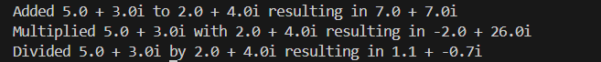
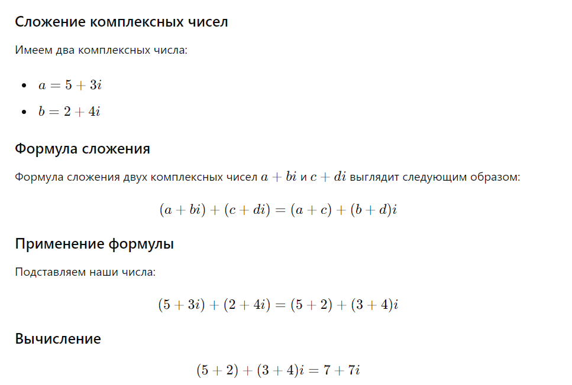
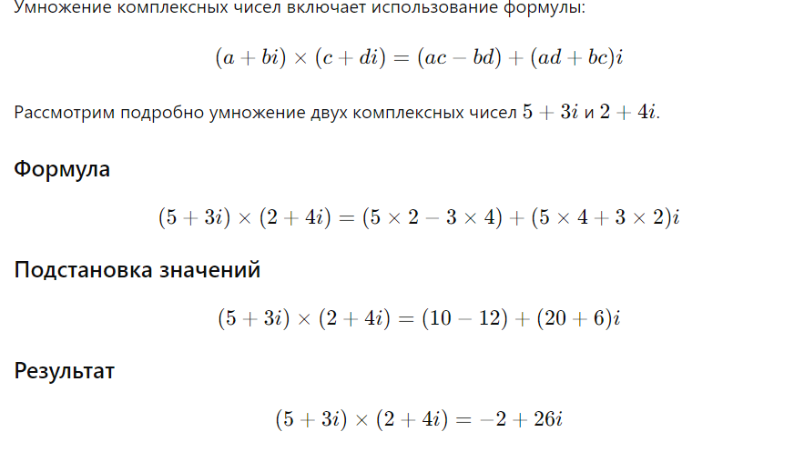
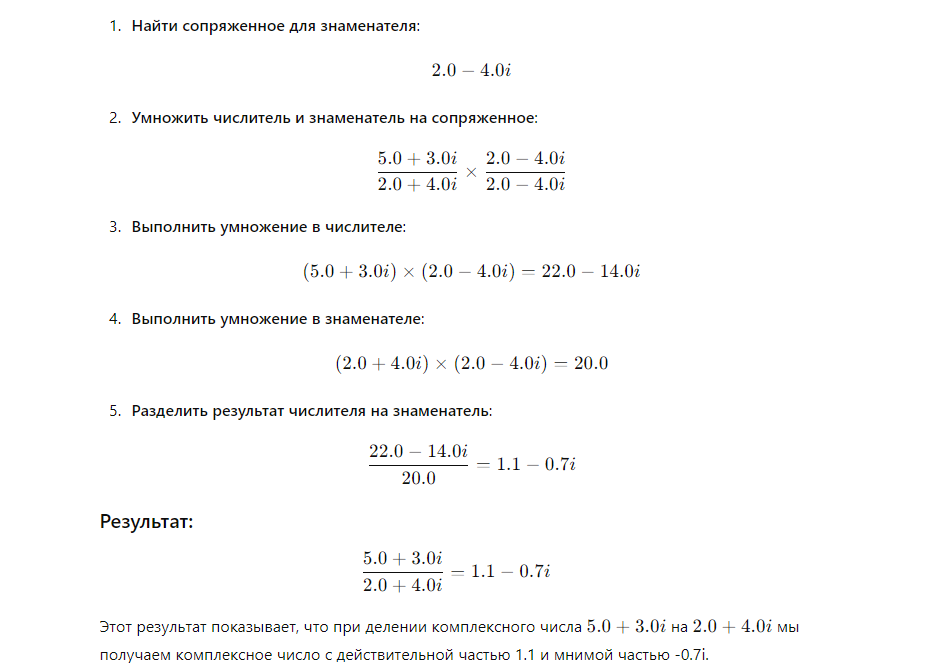

# Промежуточная аттестация
## Объектно-ориентированное программирование

## Задача
- Создать проект калькулятора комплексных чисел (достаточно сделать сложение, умножение и деление).
- Применить при создании программы архитектурные паттерны, добавить логирование калькулятора.
- Соблюдать принципы SOLID, паттерны проектирования.

### Решение:

1. Создан репозиторий: **calc**

2. Текстовое описание решения (файл **README.md**)

3. Программа находится в ветке [`main`](https://github.com/Kutlubaeva6/calc/blob/main/Main.java "Открыть решение")

4. Описание:

Этот репозиторий содержит пример кода на языке программирования Java. Программа позволяет вычислять сумму, произведение и частное комплексных чисел.

5. Примеры использования

### Запускаем код, видим результат вывода в консоль

### Делаем проверку ввыведеного результата сложения на калькуляторе

### Делаем проверку ввыведеного результата умножения на калькуляторе

### Делаем проверку ввыведеного результата деления на калькуляторе

6. Примечания

Код написан на Java.
Для работы программы необходимо иметь установленную Java Development Kit (JDK).
Программа использует стандартный ввод и вывод для взаимодействия с пользователем.
